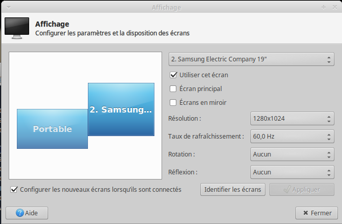

# move-to-next-monitor

Script to move windows from one monitor to the next one in Xubuntu.

I mapped `ctrl+space` to exectute this script.

## Install

`install.sh` will run `sudo apt install` to fetch related package. Look at the
code to check what will be installed.

```
git clone https://github.com/Sylvain303/move-to-next-monitor.git -b center-screen-offset
cd move-to-next-monitor
# it uses ~/bin to symlink it to this dir
./install.sh
```

## Usage

move the active window to the next monitor
```
move-to-next-monitor
```

## Features and TODO

Handle multii-screen loop.
Handle screen offset and different size.



## Internal

You can source the bash script in your current shell and call functions:

(when sourced nothing is excuted)
```
source move-to-next-monitor
```

show computed move coordinate of the given `window_id`
```
window_id=$(get_current_window)
window_compute_move $window_id
```

get window postions (x y width height)
```
window_get_position $window_id
```

move the given `window_id`
```
new_coord=( $(window_compute_move $window_id) )
echo ${new_coord[@]}
xdotool windowmove $window_id ${new_coord[0]} ${new_coord[1]}
```

list detected monitors
```
get_monitors
```

## LICENSE

GPL V3

## Code of Conduct

[We have one](code_of_conduct.md), and you're expected to follow it.

## Support

Since I don't use Xubuntu and therefore don't have a way to test changes, I'm going to rely on others to QA and give me feedback.

## Thanks

* [icyrock](http://icyrock.com/blog/2012/05/xubuntu-moving-windows-between-monitors/) post for initial development
* [@jordansissel](https://github.com/jordansissel) for his excellent [xdotool](https://github.com/jordansissel/xdotool)

## Refs
* http://stackoverflow.com/questions/18360569/how-do-you-run-an-application-in-bash-and-select-which-monitor-it-runs-on
* http://unix.stackexchange.com/questions/14159/how-do-i-find-the-window-dimensions-and-position-accurately-including-decoration
